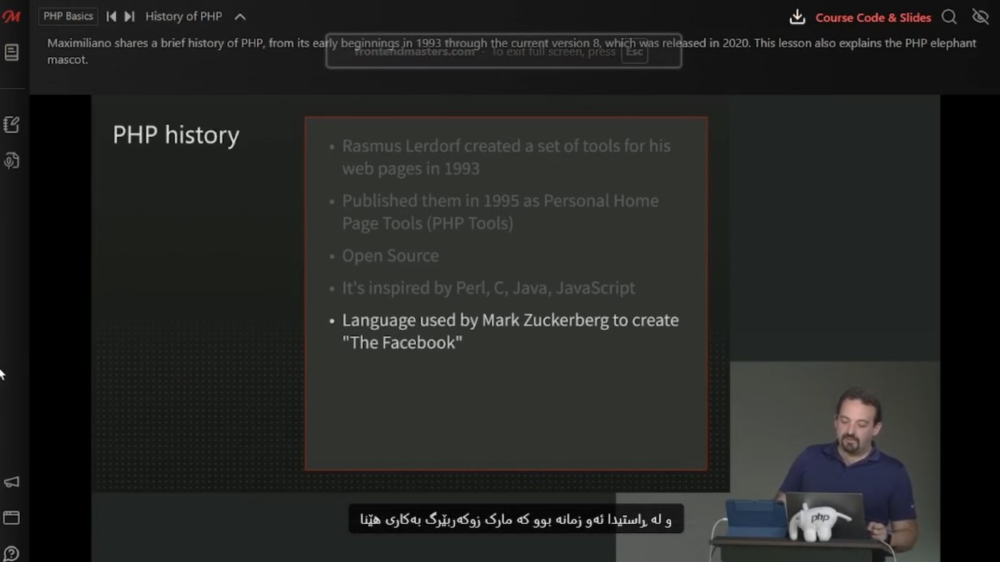

# Kurdish Subtitles

> **A browser extension translates video subtitles from other languges into Kurdish**

---

## Features ✨

*   **Instant Translation:** Automatically translates English subtitles to Kurdish (Sorani) in real time
*   **Easy to Use:** No configuration needed Just install the extension and enable subtitles on a supported video
*   **Multi-Platform Support:** works on popular learning and entertainment sites Like :
    *   YouTube
    *   Udemy
    *   *(More platforms soon?)*
*   **Open Source:** The code is public and everyone is welcome to contribute

> Want to see another site supported? Feel free to open an issue to request it?

---

## The Motivation & idea 

 Well I am a student and I watch courses and videos in English, for example, Front and Master courses. I know a little bit of English and I understand it somewhat, but sometimes there are words that I do not understand So That is why I came up with this idea: a browser extension that translates video subtitles into Kurdish helping me and others  understand the content subtitles more clearly

 ## Installation & Usage 

> **Note ⚠️:** This extension requires manual installation for now You Can Use Any Browser

1.  **Download the Extension:**
    *   Go to the [**Releases Page**](https://github.com/BDXBB/kurdish-subtitles/releases) of this repository.
    *   Download the latest version (the `.zip` file).
    *   Unzip the downloaded file on your computer.

2.  **Install in Your Browser (Google Chrome Example):**
    *   Open your browser and navigate to `chrome://extensions`.
    *   In the top-right corner enable **"Developer mode"**.
    *   Click the **"Load unpacked"** button.
    *   Select the folder you unzipped in the first step.

3.  **How to Use:** 
    *   open the [frontendmasters](https://frontendmasters.com/) site
    *   The extension will automatically display the Kurdish translation

---

## Roadmap 🗺️ (Future Plans)
We have many ideas to improve this extension Here are some of the main goals:

*   **Multi-Language Support:** Adding translation support for more languages including:
    *   Kurdish (Kurmanji) ✅
    *   Arabic ✅
    *   Persian (Farsi) ✅
    *   Russian ✅
    *   Turkish ✅
*   **Official Store Publication:** Publishing the extension to the `Chrome Web Store If i had $$$` and Firefox Add-ons store for easy one click installation Soon

---

## Contributing 🤝 

I think Contributions are what make the open-source community such an amazing place to learn inspire and create Any contributions you make are **Much appreciated**

If you have any suggestion that would make this better please fork the repo and create a pull request
1.  Fork the Project
2.  Create your Feature Branch (`git checkout -b feature/AmazingFeature`)
3.  Commit your Changes (`git commit -m "Add some AmazingFeature"`)
4.  Push to the Branch (`git push origin feature/AmazingFeature`)
5.  Open a Pull Request

---

## Contact 📧
 