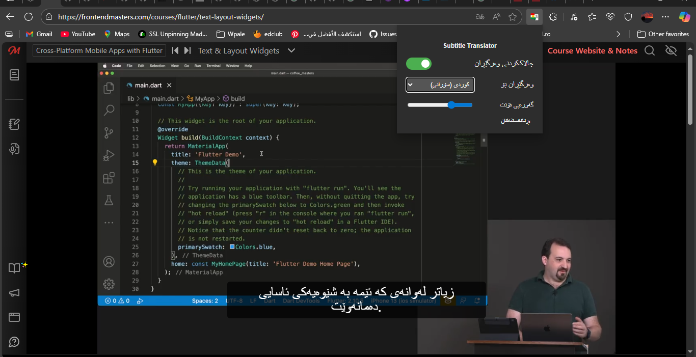
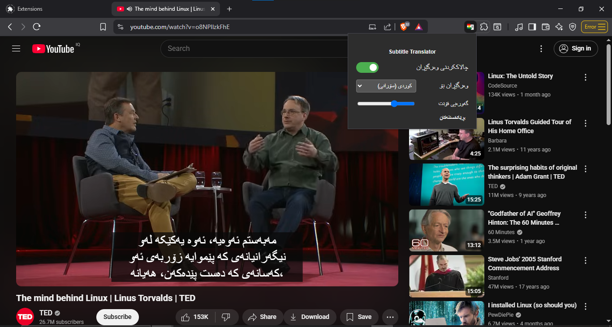

# Kurdish Subtitles

- [کوردی](ReadmeKr.md)

> **A browser extension translates video subtitles (captions) from other languges into Kurdish**

### 🎬 Demo Video

---

### Preview Screenshots 🖼️

|  |  |  |
|---------------------------|---------------------------|---------------------------|

---

## Features ✨

*   **Instant Translation:** Automatically translates English & other languages to Kurdish (Sorani) in real time
*   **Easy to Use:** No configuration needed Just install the extension and enable subtitles on a supported video
*   **Multi-Platform Support:** works on popular learning and entertainment sites Like :
    *   YouTube ✅
    *   FrontendMaster ✅
    *   Udemy ✅
    *   linkedin
    *   *(More platforms soon?)*
*   **Open Source:** The code is public and everyone is welcome to contribute

> Want to see another site supported? Feel free to open an issue to request it? or just Contact us

---

## The Motivation & idea 

 Well I am a student and I watch courses and videos in English, for example, Frontend Master courses. I know a little bit of English and I understand it somewhat, but sometimes there are words that I do not understand So That is why I came up with this idea: a browser extension that translates video subtitles into Kurdish helping me and others  understand the content subtitles more clearly

 ## Installation & Usage 
 
 ### For Firefox Users ✅

 The extension is now officially available on the Firefox Add-ons Store (*^_^*)

👉 [Install from Firefox Add-ons](https://addons.mozilla.org/firefox/addon/kurdish-subtitles/)

No need for manual installation just click "Add to Firefox" and you're done.

---

### For Chrome, Edge, Brave (Manual Installation)

> **Note ⚠️:** This extension still requires  **manual installation** for now on Chrome, Edge, Brave

1.  **Download the Extension:**
    *   Go to the [**Releases Page**](https://github.com/BDXBB/kurdish-subtitles/releases) of this repository.
    *   For Chrome and other browsers, download the `.zip` file and unzip it on your compute

2.  **Install in Your Browser Chrome (and other browsers) :**
     - Open your browser and navigate to `chrome://extensions`.
     - In the top-right corner enable **"Developer mode"**.
     - Click the **"Load unpacked"** button.
     - Select the folder you unzipped in the first step.

3.  **How to Use:** 
    *   open the Supported Website
    *   The extension will automatically display the Kurdish translation
> **Note ⚠️:** Translation works only if the video already has Subtitles available

---

## Optional: Use Your Own Google API Key 🔑

Sometimes because of high usage maybe your IP might get temporarily blocked or banned from using Google's translation service

So To avoid this you can just use your own Google Translate API key **From google cloud console**

### How to Add Your API Key

1. Open the extension popup
2. Click on the **Settings** section
3. Enter your API key in the **Google API Key** input field
4. Click **Save** to store the key & You can delete it anytime using the **Delete** button

> **Note ⚠️:** This is optional The extension works without it unless your IP is rate-limited by Google

---

## Roadmap 🗺️ (Future Plans)
We have many ideas to improve this extension Here are some of the main goals:

*   **Multi-Language Support:** Adding translation support for more languages including:
    *   Kurdish (Kurmanji) ✅
    *   Arabic ✅
    *   Persian (Farsi) ✅
    *   Russian ✅
    *   Turkish ✅
*   **Multi-Language Popup menu:**
    *   Kurdish (Kurmanji) ✅
    *   English ✅
    *   Arabic ✅
*   **Official Store Publication:** Publishing the extension for easy one click installation 
    *   **Firefox Add-ons Store:** ✅ Available now: [Install from Firefox](https://addons.mozilla.org/firefox/addon/kurdish-subtitles/)
    * **Chrome Web Store:** if I create a Devloper account for $5 not yet
    * **Edge Web Store:** Soon
*  **Mobile App (Android & iOS):** Support for mobile devices (Android & iOS) With Flutter [Kurdish Subtitles app](https://github.com/BDXBB/kurdish-subtitles-app) Soon
---

## Contributing 🤝 

I think Contributions are what make the open-source community such an amazing place to learn inspire and create Any contributions you make are **Much appreciated**

If you have any suggestion that would make this better please fork the repo and create a pull request
1.  Fork the Project
2.  Create your Feature Branch (`git checkout -b feature/AmazingFeature`)
3.  Commit your Changes (`git commit -m "Add some AmazingFeature"`)
4.  Push to the Branch (`git push origin feature/AmazingFeature`)
5.  Open a Pull Request

---

## Contact 📧
 

 ---

 Made with ❤️ for Kurdish learners