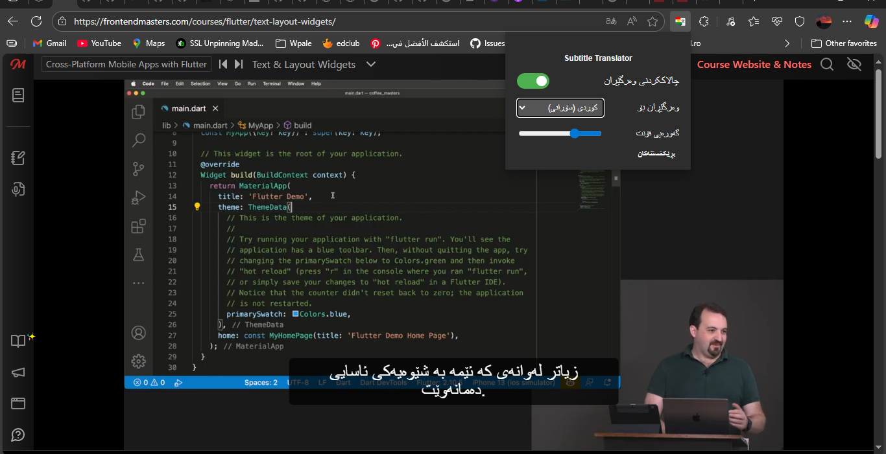
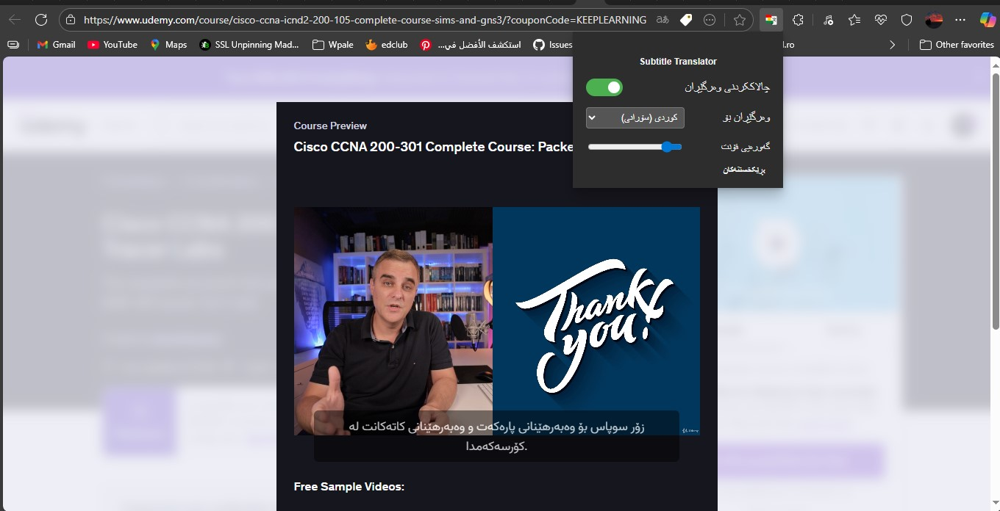
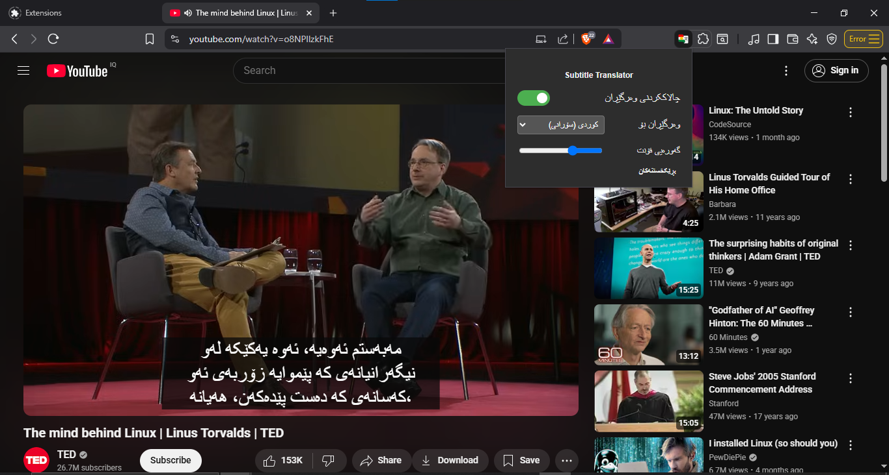

# ژێرنووسی کوردی

- [English](Readme.md)

> **ئكستێنشنێک بۆ وێب کە ژێرنووسی ڤیدیۆکان (captions) لە زمانەکانی ترەوە بۆ کوردی وەردەگێڕێت**

### 🎬 ڤیدیۆ

---

### وێنە  🖼

|  |  |  |
| :------------------------ | :------------------------ | :------------------------ |

---

## تایبەتمەندییەکان ✨

**وەرگێڕانی خێرا:** زمانەکانی ئینگلیزی و زمانەکانی تر وەردەگێڕێت بۆ کوردی (سۆرانی) ... لە کاتی ڕاستەقینەدا.

**بەکارهێنانی ئاسان:** پێویستی بە هیچ ڕێکخستنێک تایبەت نییە. تەنها ئكستێنشنەکە دابەزێنە و ئنستاڵی بکە و چالاکی بکە.

**پشتگیریکردنی چەندین پلاتفۆرم:** لەسەر مەڵپەڕەکانی فێربوون و کات بەسەربردنە باوەکان کاردەکات وەک:

<ul>

<li>یوتیوب ✅</li>
<li>FrontendMaster ✅</li>
<li>Udemy ✅</li>
<li>LinkedIn</li>
<li>زیاتر لە داهاتوودا؟</li>

</ul>

**(Open Source):** سه‌رچاوە کراوەیە و هه‌موو کەس دەتوانێ بەشداربێت

> دەتەوێت ماڵپەڕی تر پشتگیری بکرێت؟ ئازادانە دەتوانی issue بکەیتەوە بۆ ئەوەی داوای بکەیت؟ یان تەنها پەیوەندیمان پێوە بکەی

---

## هۆکار و بیرۆکە

من خوێندکارم و وانە و ڤیدیۆ بە زمانی ئینگلیزی سەیری دەکەم، بۆ نموونە وانەکانی Frontend Master. کەمێک زمانی ئینگلیزی دەزانم و تا ڕادەیەک  لێی تێ دەگەم، بەڵام هەندێک وشە هەن کە لێیان تێ ناگەم. لەبەر ئەوە ئەم بیرۆکەیەم لا دروست بوو: ئكستێنشنێک بۆ وێب کە ژێرنووسی ڤیدیۆکان بۆ زمانی کوردی وەرگێڕێت . بۆ ئەوەی یارمەتیم بدات بۆ ئەوەی زیاتر لە وانەکانم تێ بگەم و یارمەتی کەسانی تریش بدات

## ئنستاڵ کردن و بەکارهێنان

> **تێبینی ⚠️:** ئەم ئكستێنشنەکە بۆ ئێستا پێویستی بە **ئنستاڵ کردنی دەستی** هەیە. دەتوانیت Edge, Chrome, Brave, Firefox بەکاربهێنیت.
<ol dir="rtl">

<li>

**دابەزاندنی ئكستێنشنەکە:**
    <ul dir="rtl">
    <li>بڕۆ بۆ [**Releases Page**](https://github.com/BDXBB/kurdish-subtitles/releases) لەم ڕیبۆ. </li>
    <li>بۆ Firefox, فایلە تایبەتەکەی `Firefox .xpi` دابگرە (و دەتوانی ڕاستەوخۆ بەکاری بهێنیت لە Firefox).</li>
    <li>بۆ Chrome و وێبگەڕەکانی تر، فایلی `.zip`ەکە دابەزێنە و لەسەر کۆمپیوتەرەکەت بیکەرەوە unzip بکە بە rar یان هەر بەرنامەیەکی تر.</li>
    </ul>
</li>

<li>

**ئنستاڵ کردن:**
    <ul dir="rtl">
        **Firefox:**
       <li>Firefox بکەرەوە.</li>
        <li>بڕۆ بۆ مینو و هەڵبژێرە "Add-ons and Themes" → "Extensions".</li>
        <li>کلیک لە ئایکۆنی ⚙ بکە ← "Install Add-on From File" و فایلە `.xpi` کە داتگرتووە هەڵبژێرە.</li>
       **Chrome (و وێبگەڕەکانی تر):**
        <li>وێبگەڕەکەت (browser) بکەرەوە و بڕۆ بۆ `chrome://extensions`.</li>
        <li>لە لای سەری ڕاست، "Developer mode" چالاک بکە.</li>
        <li>کرتە بکە لەسەر دوگمەی **"Load unpacked"**.</li>
        <li>فۆڵدەرەکە هەڵبژێرە کە لە هەنگاوی یەکەمدا unzipت کردووە .<li>
    </ul>
</li>

<li>

**چۆن بەکاریبهێنیت:**
<ul>
    <li>ماڵپەڕی پشتگیریکراو بکەرەوە.</li>
    <li>ئكستێنشنەکە بە شێوەیەکی خودکار وەرگێڕانی کوردی نیشان دەدات.</li>

> **تێبینی ⚠️:** وەرگێڕان کاردەکات تەنها ئەگەر ڤیدیۆکە خۆی ژێرنووسی هەبێت بە ئنگلیزی یان هەرزمانێکی تر
</ul>
</li>

</ol>

---

## هەڵبژاردەیی: بەکارهێنانی گوگڵ API ی خۆت 🔑 

هەندێکجار لەبەر زیادەڕەوی لە بەکارهێنان. ئایپی تۆ لەوانەیە بە شێوەیەکی کاتی بلۆک بکرێت لە بەکارهێنانی خزمەتگوزاری وەرگێڕانی گووگڵ بۆ ماوەیەکی کاتی .

بۆ خۆلادان لەمە، دەتوانیت کلیلە API خۆت لە **Google Cloud Console** بەکاربهێنیت.

<ol>

<li>پوپ ئەپی ئكستێنشنەکە بکەرەوە.</li><li>

کلیک بکە لەسەر بەشی **Settings**.</li><li>
کلیلە API خۆت لە خانەی **Google API Key** داخڵ بکە.</li><li>
کلیک بکە لەسەر **Save** بۆ هەڵگرتنی کلیلەکە. دەتوانیت هەر کاتێک ویستت بە **Delete** بۆ سڕینەوەی.</li>
</ol>

> **تێبینی ⚠️:** ئەمە هەڵبژاردەییە. ئكستێنشنەکە بێ Google API Key کاردەکات مەگەر ئایپی تۆ لەلایەن گووگڵەوە سنووردار کرابێت.

---

## پلانی داهاتوو 🗺️
ئێمە چەندین بیرۆکەمان هەیە بۆ باشترکردنی ئەم ئكستێنشنەکە. لێرەدا هەندێک لە ئامانجەکان:

<ul>

<li>

**پشتگیریکردنی چەندین زمان:** زیادکردنی پشتگیریکردنی وەرگێڕان بۆ زمانەکانی تر وەک:</li>
    <li>کوردی (کورمانجی) ✅</li>
    <li>عەرەبی ✅</li>
    <li>فارسی ✅</li>
    <li>ڕووسی ✅</li>
    <li>تورکی ✅</li><li>**پۆپ مینو بە چەندین زمان:**</li>
    <li>کوردی (کورمانجی) ✅</li>
    <li>ئینگلیزی ✅</li>
    <li>عەرەبی ✅</li><li>**بڵاوکردنەوەی لە ستۆر:** بڵاوکردنەوەی ئكستێنشنەکە لە `Chrome Web Store ئەگەر ئەکاونت دروست بکەم بە 5$ جارێ نا` و Firefox Add-ons store بۆ دابەزاندن و ئنستاڵ کردن بە یەک کلیک بەمزوانە</li>
    <li>**ئەپی مۆبایل (Android & iOS):** پشتگیری بۆ ئامێرە مۆبایلەکان (Android & iOS) لەگەڵ Flutter بەم زووانە </li>
</ul>

---

## Contributing 🤝 

I think Contributions are what make the open-source community such an amazing place to learn inspire and create Any contributions you make are **Much appreciated**

If you have any suggestion that would make this better please fork the repo and create a pull request
1.  Fork the Project
2.  Create your Feature Branch (`git checkout -b feature/AmazingFeature`)
3.  Commit your Changes (`git commit -m "Add some AmazingFeature"`)
4.  Push to the Branch (`git push origin feature/AmazingFeature`)
5.  Open a Pull Request

---

## پەیوەندی 📧

---

بە ❤️ دروست کراوە بۆ فێرخوازانی کورد